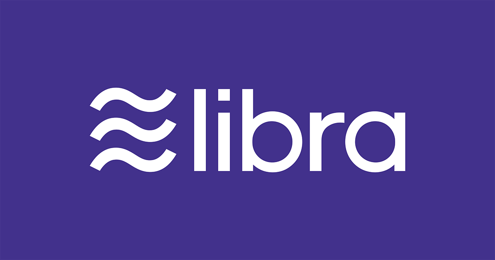

# LibraBFT

### Algorithm

> Validators take turns driving the process of accepting transactions. When a validator acts as a leader, it proposes transactions, both those directly submitted to it by clients and those indirectly submitted through other validators, to the other validators. All validators execute the transactions and form an authenticated data structure that contains the new ledger history. The validators vote on the authenticator for this data structure as part of the consensus protocol

...

> As part of committing a transaction Ti at version i, the consensus protocol outputs a signature on the full state of the database at version i — including its entire history — to authenticate responses to queries from clients." ... "The Libra protocol uses an account-based data model to encode the ledger state.

...

> "Executing a transaction T i produces a new ledger state S i as well as the execution status code, gas usage, and event list.

### Pros

* Because of the signature on the full state of the database, in every transactions, new validators should be able to join the network and sync quickly without having to replay the entire history of the blockchain, assuming that they trust the existing validators.
* pseudonimity:   "The Libra protocol does not link accounts to a real-world identity. A user is free to create multiple accounts by generating multiple key-pairs. Accounts controlled by the same user have no inherent link to each other. This scheme follows the example of Bitcoin and Ethereum in that it provides pseudonymity for users."

### Cons

* You have to trust validators. 
* POS have to show that is still working when transitioning to permission-less network

### Used In

* LibraBFT which is a variant of the HotStuff consensus protocol.

### Whitepaper

* [https://developers.libra.org/docs/assets/papers/libra-consensus-state-machine-replication-in-the-libra-blockchain.pdf](https://developers.libra.org/docs/assets/papers/libra-consensus-state-machine-replication-in-the-libra-blockchain.pdf)
* [https://developers.libra.org/docs/assets/papers/the-libra-blockchain.pdf](https://developers.libra.org/docs/assets/papers/the-libra-blockchain.pdf)

### Read More

* [https://medium.com/@lopp/thoughts-on-libra-blockchain-49b8f6c26372](https://medium.com/@lopp/thoughts-on-libra-blockchain-49b8f6c26372)

